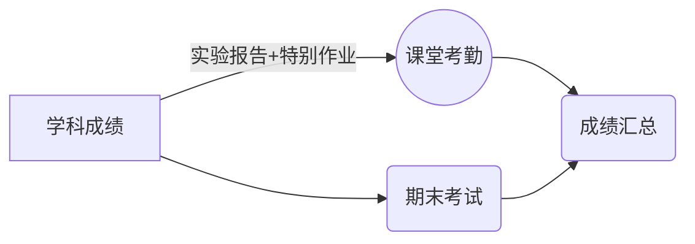

# 24-计算机网络技术4班成绩历史记录
本学期直接在github上展示。每个同学可以看到自己成绩变化的情况。

- 公开，公开是最好的*主
- 公正
- 信息及时传递

## 课代表+10分，已经提前说明。

```mermaid
graph LR
A[学科成绩] -- 实验报告+特别作业 --> B((课堂考勤))
A --> C(期末考试)
B --> D(成绩汇总)
C --> D
```
